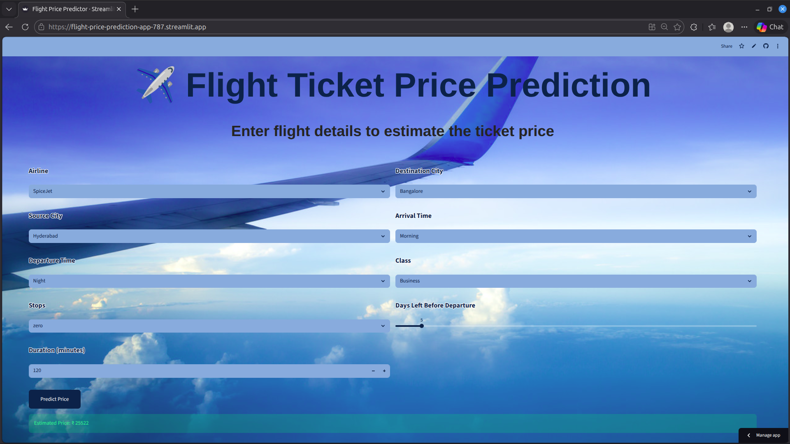

# Flight Price Prediction App

A machine learning powered web application that predicts flight ticket prices based on user inputs such as airline, source & destination city, stops, travel class, duration, and days left before departure.

The app is built using **Streamlit** and deployed on Streamlit Cloud.

🔗 **Live Demo:**  
https://flight-price-prediction-app-787.streamlit.app/

--- 

## Features

- Predicts estimated flight ticket price in Indian Rupees
- Clean and intuitive user interface
- Uses a trained machine learning model
- Works for major Indian cities and airlines
- Instant predictions with efficient backend

---

## How It Works

1. User selects flight details using a form in the app
2. Inputs include:
   - Airline
   - Source city
   - Destination city
   - Departure time
   - Arrival time
   - Number of stops
   - Travel class (Economy/Business)
   - Flight duration
   - Days left before departure
3. Backend ML model processes inputs and predicts price
4. Result is shown immediately in the app

---
